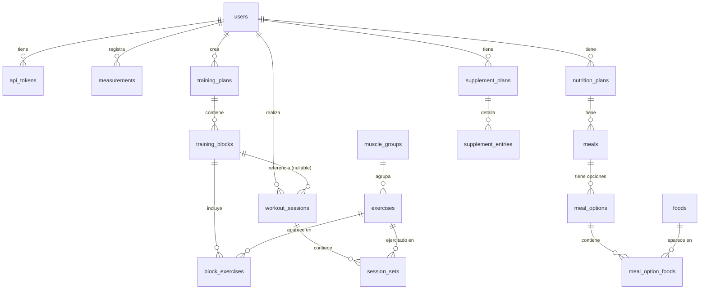

# Base de datos — gym_tracker

Esquema MariaDB. Motor InnoDB, charset `utf8mb4_unicode_ci`.

---

## Diagrama ER

---

## Usuarios y autenticación

### `users`
Cuentas de usuario. `role` y `is_active` controlan el acceso a la API.

| Columna | Tipo | Notas |
|---|---|---|
| `id` | `int unsigned` PK | |
| `name` | `varchar(100)` | |
| `email` | `varchar(150)` | UNIQUE |
| `password_hash` | `varchar(255)` | bcrypt |
| `role` | `enum('admin','user')` | default `'user'` |
| `is_active` | `tinyint(1)` | default `1` — usuarios desactivados no pueden autenticarse |
| `birthdate` | `date` | nullable |
| `gender` | `enum('male','female','other')` | nullable |
| `height_cm` | `decimal(5,2)` | nullable |
| `created_at` | `timestamp` | auto |

### `api_tokens`
Tokens Bearer emitidos en login/registro. Se eliminan en CASCADE si se borra el usuario.

| Columna | Tipo | Notas |
|---|---|---|
| `id` | `int unsigned` PK | |
| `user_id` | `int unsigned` FK→`users` | ON DELETE CASCADE |
| `token` | `char(64)` | UNIQUE — hex de 32 bytes aleatorios |
| `last_used_at` | `datetime` | se actualiza en cada request autenticado |
| `expires_at` | `datetime` | nullable — sin valor = no expira |
| `created_at` | `timestamp` | auto |

---

## Catálogo de ejercicios

### `muscle_groups`
Catálogo estático de grupos musculares. `name` es UNIQUE.

| Columna | Tipo | Notas |
|---|---|---|
| `id` | `tinyint unsigned` PK | |
| `name` | `varchar(50)` | UNIQUE |

### `exercises`
Catálogo de ejercicios. `tracking_type` determina qué campos registrar en cada serie.

| Columna | Tipo | Notas |
|---|---|---|
| `id` | `int unsigned` PK | |
| `muscle_group_id` | `tinyint unsigned` FK→`muscle_groups` | |
| `name` | `varchar(150)` | |
| `tracking_type` | `enum('reps','time')` | `reps` → usa `weight_kg`+`reps`; `time` → usa `duration_sec` |
| `organization` | `enum('N/A','Circuito','Estaciones','Biserie','Triserie','Superserie')` | default `'N/A'` |
| `method` | `varchar(150)` | nullable |
| `default_sets` | `tinyint unsigned` | nullable — sugerencia para el bloque |
| `default_reps` | `tinyint unsigned` | nullable |
| `default_rest_sec` | `smallint unsigned` | nullable |
| `notes` | `text` | nullable |

---

## Planificación del entrenamiento

### `training_plans`
Plan de entrenamiento de un usuario. Solo un plan con `active=1` e `is_draft=0` se sirve como activo.

| Columna | Tipo | Notas |
|---|---|---|
| `id` | `int unsigned` PK | |
| `user_id` | `int unsigned` FK→`users` | |
| `name` | `varchar(100)` | |
| `start_date` | `date` | nullable |
| `end_date` | `date` | nullable |
| `active` | `tinyint(1)` | default `0` — solo uno activo por usuario |
| `is_draft` | `tinyint(1)` | default `0` — los borradores no se sirven como activos |
| `notes` | `text` | nullable |
| `created_at` | `timestamp` | auto |

### `training_blocks`
Bloques de días/focus dentro de un plan (p.ej. "Bloque A — Pecho y Tríceps").

| Columna | Tipo | Notas |
|---|---|---|
| `id` | `int unsigned` PK | |
| `plan_id` | `int unsigned` FK→`training_plans` | |
| `block_order` | `tinyint unsigned` | orden de presentación |
| `name` | `varchar(50)` | nullable |
| `assigned_days` | `varchar(20)` | nullable — p.ej. `"Lun, Mié"` |
| `focus` | `varchar(100)` | nullable — grupos musculares del bloque |

### `block_exercises`
Pivot que asigna ejercicios a un bloque, con overrides opcionales sobre los defaults del ejercicio.

| Columna | Tipo | Notas |
|---|---|---|
| `id` | `int unsigned` PK | |
| `block_id` | `int unsigned` FK→`training_blocks` | |
| `exercise_id` | `int unsigned` FK→`exercises` | |
| `exercise_order` | `tinyint unsigned` | nullable |
| `sets_override` | `tinyint unsigned` | nullable — sobreescribe `exercises.default_sets` |
| `reps_override` | `tinyint unsigned` | nullable |
| `rest_override` | `smallint unsigned` | nullable |
| `duration_override_sec` | `smallint unsigned` | nullable — para ejercicios de tipo `time` |
| `method_override` | `varchar(150)` | nullable |
| `organization_override` | `enum('Circuito','Estaciones','Triserie','Superserie','N/A')` | nullable |
| `notes` | `varchar(200)` | nullable |

---

## Registro de entrenamiento

### `workout_sessions`
Sesiones de entrenamiento realizadas. `block_id` es nullable para permitir sesiones libres no vinculadas a ningún bloque del plan.

| Columna | Tipo | Notas |
|---|---|---|
| `id` | `int unsigned` PK | |
| `user_id` | `int unsigned` FK→`users` | |
| `block_id` | `int unsigned` FK→`training_blocks` | nullable — sesión libre si NULL |
| `session_date` | `date` | |
| `duration_min` | `smallint unsigned` | nullable |
| `notes` | `text` | nullable |
| `created_at` | `timestamp` | auto |

### `session_sets`
Series individuales de una sesión. Los campos activos dependen del `tracking_type` del ejercicio; el otro grupo queda en NULL.

| Columna | Tipo | Notas |
|---|---|---|
| `id` | `int unsigned` PK | |
| `session_id` | `int unsigned` FK→`workout_sessions` | |
| `exercise_id` | `int unsigned` FK→`exercises` | |
| `set_number` | `tinyint unsigned` | asignado automáticamente por la API (COUNT+1 por ejercicio en la sesión) |
| `weight_kg` | `decimal(6,2)` | nullable — solo para `tracking_type='reps'` |
| `reps` | `tinyint unsigned` | nullable — solo para `tracking_type='reps'` |
| `duration_sec` | `smallint unsigned` | nullable — solo para `tracking_type='time'` |
| `rir` | `tinyint unsigned` | nullable — Reps In Reserve |
| `notes` | `varchar(200)` | nullable |

---

## Medidas corporales

### `measurements`
Snapshot periódico de composición corporal de un usuario.

| Columna | Tipo | Notas |
|---|---|---|
| `id` | `int unsigned` PK | |
| `user_id` | `int unsigned` FK→`users` | |
| `measured_at` | `date` | fecha de la medición |
| `weight_kg` | `decimal(5,2)` | nullable |
| `body_fat_pct` | `decimal(4,2)` | nullable |
| `muscle_pct` | `decimal(4,2)` | nullable |
| `visceral_fat` | `tinyint unsigned` | nullable |
| `bmi` | `decimal(4,2)` | nullable |
| `neck_cm` | `decimal(5,2)` | nullable |
| `arm_right_cm` / `arm_left_cm` | `decimal(5,2)` | nullable |
| `waist_cm` / `hip_cm` | `decimal(5,2)` | nullable |
| `leg_right_cm` / `leg_left_cm` | `decimal(5,2)` | nullable |
| `calves_cm` / `chest_cm` | `decimal(5,2)` | nullable |
| `maintenance_kcal` | `smallint unsigned` | nullable — kcal de mantenimiento estimadas |
| `diet_kcal` | `smallint unsigned` | nullable — objetivo calórico |
| `training_goal` | `varchar(150)` | nullable |
| `notes` | `text` | nullable |
| `created_at` | `timestamp` | auto |

---

## Nutrición

### `nutrition_plans`
Plan nutricional mensual con targets macro. `plan_month` almacena el primer día del mes (`YYYY-MM-01`).

| Columna | Tipo | Notas |
|---|---|---|
| `id` | `int unsigned` PK | |
| `user_id` | `int unsigned` FK→`users` | |
| `plan_month` | `date` | primer día del mes objetivo |
| `target_kcal` | `smallint unsigned` | nullable |
| `protein_g` / `carbs_g` / `fat_g` | `smallint unsigned` | nullable — targets diarios |
| `active` | `tinyint(1)` | default `0` |
| `is_draft` | `tinyint(1)` | default `0` |
| `notes` | `text` | nullable |
| `created_at` | `timestamp` | auto |

### `meals`
Comidas del plan (desayuno, almuerzo, etc.) en orden.

| Columna | Tipo | Notas |
|---|---|---|
| `id` | `int unsigned` PK | |
| `plan_id` | `int unsigned` FK→`nutrition_plans` | |
| `meal_order` | `tinyint unsigned` | |
| `name` | `varchar(80)` | |

### `meal_options`
Alternativas para una comida (Opción A / Opción B). Permite variedad sin duplicar el plan.

| Columna | Tipo | Notas |
|---|---|---|
| `id` | `int unsigned` PK | |
| `meal_id` | `int unsigned` FK→`meals` | |
| `option_number` | `tinyint unsigned` | |
| `notes` | `text` | nullable |

### `meal_option_foods`
Alimentos que componen una opción de comida, con la cantidad en gramos. Los macros se calculan dinámicamente (`quantity_g * macro_per_100g / 100`) — no se almacenan aquí.

| Columna | Tipo | Notas |
|---|---|---|
| `id` | `int unsigned` PK | |
| `meal_option_id` | `int unsigned` FK→`meal_options` | |
| `food_id` | `int unsigned` FK→`foods` | |
| `quantity_g` | `decimal(6,2)` | gramos de la porción |
| `preparation` | `varchar(100)` | nullable — p.ej. "cocido", "crudo" |

### `foods`
Catálogo de alimentos con macros por 100g.

| Columna | Tipo | Notas |
|---|---|---|
| `id` | `int unsigned` PK | |
| `name` | `varchar(150)` | |
| `brand` | `varchar(100)` | nullable |
| `calories_kcal` | `decimal(6,2)` | por 100g |
| `protein_g` / `carbs_g` / `fat_g` | `decimal(5,2)` | por 100g |
| `fiber_g` | `decimal(5,2)` | nullable, por 100g |
| `serving_size_g` | `decimal(6,2)` | nullable — porción de referencia |
| `serving_unit` | `varchar(30)` | nullable — p.ej. "1 taza", "1 pieza" |
| `category` | `enum('Proteína','Carbohidrato','Grasa','Fruta','Vegetal','Lácteo','Suplemento','Otro')` | default `'Otro'` |
| `notes` | `text` | nullable |
| `created_at` | `timestamp` | auto |

---

## Suplementación

### `supplement_plans`
Protocolo de suplementación mensual.

| Columna | Tipo | Notas |
|---|---|---|
| `id` | `int unsigned` PK | |
| `user_id` | `int unsigned` FK→`users` | |
| `plan_month` | `date` | primer día del mes |
| `active` | `tinyint(1)` | default `0` |
| `is_draft` | `tinyint(1)` | default `0` |
| `notes` | `text` | nullable |
| `created_at` | `timestamp` | auto |

### `supplement_entries`
Entradas del protocolo: un suplemento por fila con dosis y momento de toma.

| Columna | Tipo | Notas |
|---|---|---|
| `id` | `int unsigned` PK | |
| `plan_id` | `int unsigned` FK→`supplement_plans` | |
| `supplement_name` | `varchar(100)` | |
| `dose` | `varchar(100)` | nullable — p.ej. "5g", "1 cápsula" |
| `timing` | `varchar(150)` | nullable — p.ej. "pre-entrenamiento", "con el desayuno" |

---

## Notas de diseño

- **`active` + `is_draft`**: un plan puede estar `active=1` pero `is_draft=1` y la API no lo sirve como activo. El modelo filtra `is_draft = 0` en la consulta de plan activo.
- **Macros en nutrición**: los valores calóricos por porción no se persisten — se calculan en tiempo de consulta a partir de `quantity_g` y los macros por 100g de `foods`.
- **`set_number`**: la API lo asigna automáticamente (COUNT de series del mismo ejercicio en la sesión + 1). El cliente no lo envía.
- **`workout_sessions.block_id` nullable**: permite registrar sesiones libres sin asociarlas a ningún bloque del plan activo. Al borrar un plan, las sesiones existentes quedan con `block_id = NULL`.
